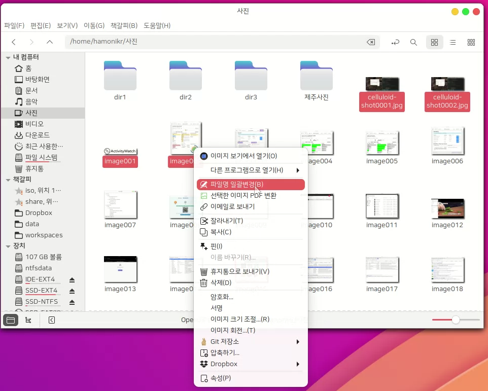
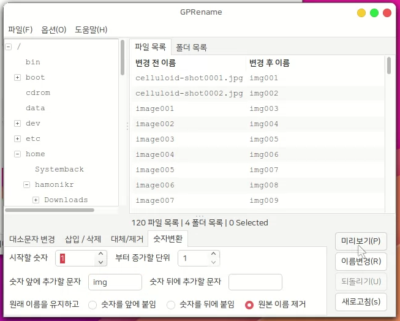

# hamonikr-gprename

하모니카 사용자를 위한 파일명 또는 폴더명 일괄 변경 프로그램

이 프로그램으로 파일 탐색기에서 선택한 폴더 또는 파일의 이름을 일괄 변경할 수 있습니다.
 
 * upstream : https://sourceforge.net/projects/gprename/
 * nemo action : https://github.com/smurphos/nemo_actions_and_cinnamon_scripts






# License
 * [LICENSE](COPYING.TXT)

# Install

## HamoniKR 사용자의 경우 HamoniKR-ME (>= 1.4)
터미널을 열고(Ctrl+Alt+T) 아래 명령어를 입력하세요.

```
sudo apt update
sudo apt install -y gprename
```

## Ubuntu, LinuxMint 등 다른 배포판 사용자의 경우 Ubuntu (>= 18.04), LinuxMint(>=19)
터미널을 열고(Ctrl+Alt+T) 아래 명령어를 입력하세요.

```
curl -sL https://pkg.hamonikr.org/add-hamonikr.apt | sudo -E bash -
sudo apt install -y gprename
```


# Usage
 * 프로그램 > `마우스 휠 속도 설정` 실행

 # 이슈 또는 버그
 사용 중 문제를 발견하시면 root@hamonikr.org 또는 https://groups.google.com/forum/m/#!forum/hamonikr 에서 알려주세요.
